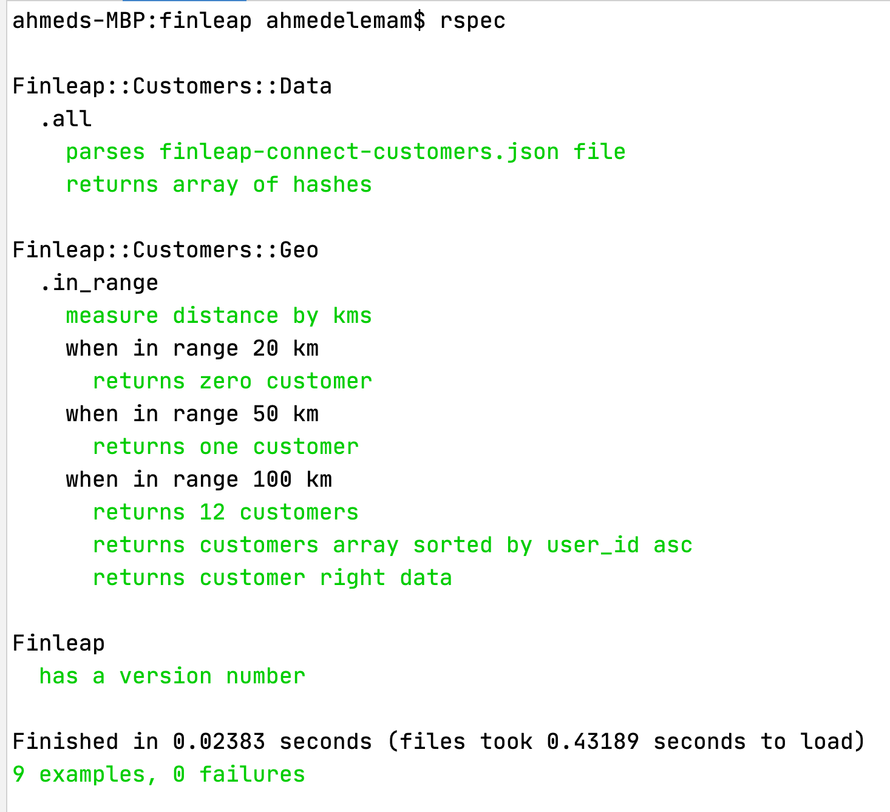

# Finleap

We have some customer records in a text file (customers.json) -- one
customer per line, JSON-encoded. We want to invite any customer
within 100km of our Berlin office for some food and drinks. Write a
program that will read the full list of customers and output the names and
user ids of matching customers (within 100km), sorted by User ID
(ascending).

You can use the first formula from this Wikipedia article to
calculate distance. Don't forget, you'll need to convert degrees to
radians.

The GPS coordinates for our Berlin office are 52.508283,
13.329657

## Installation

Add this line to your application's Gemfile:

```ruby
gem 'finleap'
```

And then execute:

    $ bundle install

Or install it yourself as:

    $ gem install finleap

## Usage

After installing the gem you can try it by

    irb
    require 'finleap'
    Finleap::Customers::Geo.in_range(50)
     => [{"user_id"=>6, "name"=>"Nolan Little", "latitude"=>52.16209823311126, "longitude"=>13.543372863802071}]

you can change the range also and the result will be array of sorted by user_id hashes

    > Finleap::Customers::Geo.in_range(100)
     => [{"user_id"=>4, "name"=>"Ernesto Breitenberg", "latitude"=>52.94260786195436, "longitude"=>13.067312769068188},
     {"user_id"=>6, "name"=>"Nolan Little", "latitude"=>52.16209823311126, "longitude"=>13.543372863802071},
     {"user_id"=>14, "name"=>"Burt Klein Esq.", "latitude"=>53.1265734799671, "longitude"=>12.699384236532275},
     {"user_id"=>19, "name"=>"Eldridge Funk DDS", "latitude"=>52.147558277671415, "longitude"=>13.804602080070971},
     {"user_id"=>25, "name"=>"Maggie Trantow", "latitude"=>53.10974927389135, "longitude"=>13.013782063005134},
     {"user_id"=>29, "name"=>"Arden Kshlerin", "latitude"=>52.61428145536312, "longitude"=>14.246534306873425},
     {"user_id"=>30, "name"=>"Candi Larkin", "latitude"=>51.7136432343531, "longitude"=>13.53599402401951},
     {"user_id"=>35, "name"=>"Blondell Hermiston", "latitude"=>52.62033397021099, "longitude"=>14.716070229258861},
     {"user_id"=>36, "name"=>"Kemberly Durgan DC", "latitude"=>52.07953938789886, "longitude"=>14.480735257348044},
     {"user_id"=>40, "name"=>"Rafael Streich IV", "latitude"=>52.531792624998715, "longitude"=>12.177849950380875},
     {"user_id"=>42, "name"=>"Raymundo Schuster", "latitude"=>52.677794195484154, "longitude"=>12.539436329812464},
     {"user_id"=>49, "name"=>"Cole Predovic JD", "latitude"=>52.817435894229774, "longitude"=>14.280626271845067}] 
     
By using this gem we can get the list of customers ids and names so we can then send the invitation to them.

## specs



## Development

After checking out the repo, run `bin/setup` to install dependencies. Then, run `rake spec` to run the tests. You can also run `bin/console` for an interactive prompt that will allow you to experiment.

To install this gem onto your local machine, run `bundle exec rake install`. To release a new version, update the version number in `version.rb`, and then run `bundle exec rake release`, which will create a git tag for the version, push git commits and tags, and push the `.gem` file to [rubygems.org](https://rubygems.org).

## Contributing

Bug reports and pull requests are welcome on GitHub at https://github.com/[USERNAME]/finleap.


## License

The gem is available as open source under the terms of the [MIT License](https://opensource.org/licenses/MIT).
